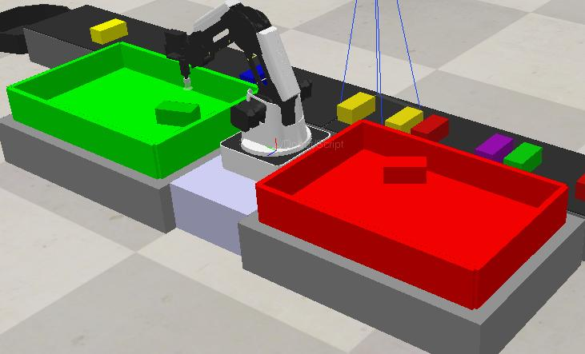
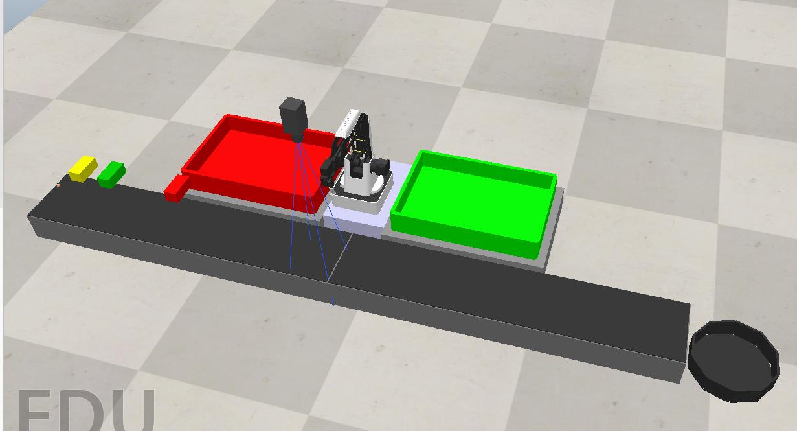
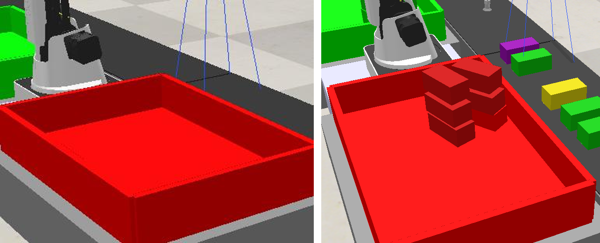
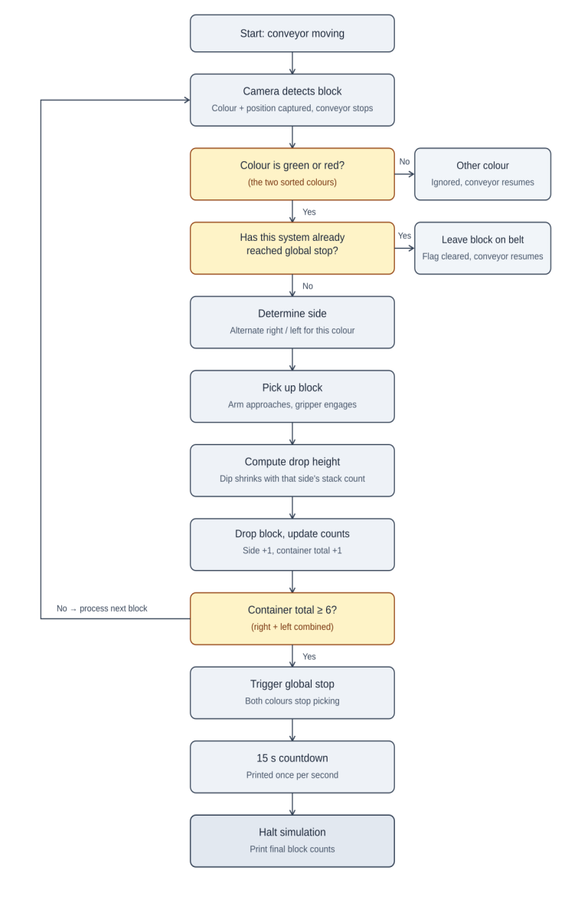

# Dobot Colour-Sorting Workstation — CoppeliaSim

An automated pick-and-place cell built in **CoppeliaSim**. A **Dobot** 4-axis arm with a suction gripper picks coloured blocks off a conveyor and sorts them by colour, using a depth/vision camera. Green blocks go to the green container and red blocks to the red one. Any other colour stays on the belt and ends up in a bin.

Each container is filled as **two separate stacks that grow at the same time and never touch**. When either container holds six blocks, the whole cell stops by itself.



▶ **[Demo video](media/demo.mp4)** (3.7 min)

## Features

- **Colour detection** from the vision sensor's colour/depth image. It recognises red, green, yellow, blue, orange and purple.
- **Conveyor–arm handshake**: the belt stops when a red or green block reaches the camera, and starts again once the arm has picked it up. The arm only ever deals with one block at a time.
- **Colour-matched sorting**: red and green blocks are placed in their own containers. Other colours are logged and passed through to the bin.
- **Dual-slot stacking (bonus criterion)**: each container has two drop points, ±34° from its centreline. Blocks alternate between the two, and each slot's drop height depends only on how many blocks are already in that slot. The two piles can't collide, even when one gets ahead of the other.
- **Smooth motion**: every joint move goes through one `moveToConfig` helper with velocity, acceleration **and jerk** limits (30°/s, 45°/s², 80°/s³). This stops sudden jolts from shaking a block off the suction cup.
- **Global stop**: as soon as either container reaches 6 blocks, the arm stops picking both colours, counts down 15 s, prints the final counts, and halts the simulation.

| Workstation layout | Dual-slot stacking (empty → filled) |
|---|---|
|  |  |

## How it works

Three Lua scripts run inside the scene and communicate through custom data properties on the `/Dobot` object:

```
┌───────────────────┐  spawns 1 block    ┌─────────────────────┐  objectDetected = 'red'|'green'|'none'  ┌──────────────────────┐
│ block_spawner.lua │ ─────────────────▶ │ camera.lua          │ ──────────────────────────────────────▶ │ dobot_arm.lua        │
│ (_BlockSpawner)   │  every 3 s, if the │ (vision sensor)     │  detectedColourName = <colour>          │ (/Dobot)             │
│ weighted random   │  spawn area clear  │ classify RGB →      │                                         │ coroutine:           │
│ colour            │                    │ stop/start conveyor │ ◀─────────── objectDetected = 'none' ── │ pick → place → home  │
└───────────────────┘                    └─────────────────────┘          (after pick)                   └──────────────────────┘
```

| Script | Attached to | Role |
|---|---|---|
| [`lua/dobot_arm.lua`](lua/dobot_arm.lua) | `/Dobot` | Main controller. A coroutine resumed from `sysCall_actuation()` runs the detect → pick → place → home cycle, the dual-slot logic and the global stop. |
| [`lua/camera.lua`](lua/camera.lua) | Vision sensor above the belt | Reads the sensor image, classifies the block's colour by RGB thresholds, stops or restarts the conveyor, and passes the result to the arm. |
| [`lua/block_spawner.lua`](lua/block_spawner.lua) | `_BlockSpawner` dummy at the start of the belt | Spawns one block every 3 s, but only while the belt is moving and the spawn area is empty. Red and green are 3× more likely than the other colours. |

### Control flow

<p align="center"></p>

### Stacking geometry

For a block going to `side` (right or left) of a container whose base swing angle is `baseSwing` (±110°):

```lua
swing = baseSwing ± SIDE_OFFSET                                  -- ±34°, alternating right/left
dipJ2 = max(MIN_DIP, BASE_DIP_J2 − sideCount × HEIGHT_STEP)      -- 40° − 10° per block already on that side
dipJ3 = max(MIN_DIP, BASE_DIP_J3 − sideCount × HEIGHT_STEP)      -- 30° − 10° per block
```

Every move goes up first and then down: the arm swings at a safe height above the drop point, lowers itself straight down, releases the block, rises, and returns home. It never sweeps sideways across a stack.

| Parameter | Value |
|---|---|
| Joint vel / accel / jerk | 30°/s, 45°/s², 80°/s³ |
| Green / red swing | +110° / −110° |
| Slot offset | ±34° |
| Base dip (J2 / J3) | 40° / 30° |
| Dip reduction per stacked block | 10° |
| Minimum dip | 8° |
| Stop threshold | 6 blocks in either container |
| Stop countdown | 15 s |

## Running it

**Requirements:** CoppeliaSim 4.6 or newer (Edu is fine).

1. Open `scene/dobot_colour_sorting.ttt` in CoppeliaSim.
2. Press **Start simulation**. Blocks start spawning, and the console shows each step (`[Spawner]`, `[Camera]` and `[Dobot]` messages).
3. The simulation stops by itself 15 s after either container reaches 6 blocks.

> All three scripts are already embedded in the scene file. The `lua/` folder has copies so you can read the code on GitHub without opening CoppeliaSim.

## Results and limitations

- In every test run, the two stacks in each container stayed separate, even when one side filled much faster than the other.
- **Tall stacks lean.** A block keeps a little velocity when the suction releases it and slides slightly on landing. The drop height is calculated from the block count, not measured, so those small offsets build up. In testing this never led to a collision. Possible fixes are a short settle delay after each release, higher-friction surfaces, or measuring the actual stack height with the depth camera.
- The pick-up pose is fixed, because the brief guarantees each block arrives at the same aligned spot. Picking blocks in random positions would need the block's pose from the camera.
- Collision avoidance relies on the known layout of the cell, not on detecting contact while the arm moves.

## Context

Coursework 2 for **6FTC2059 Industrial Robotics**, BEng Robotics and Artificial Intelligence (University of Hertfordshire, delivered at PSB Academy, Singapore). The brief asked for a simulated material-handling workstation that sorts coloured boxes from a conveyor into colour-matched containers. The bonus criteria were stacking without collisions and an automatic stop once the containers are full.

## Author

**Steve Flinston** ([@steveerobotclubsmt-create](https://github.com/steveerobotclubsmt-create))
